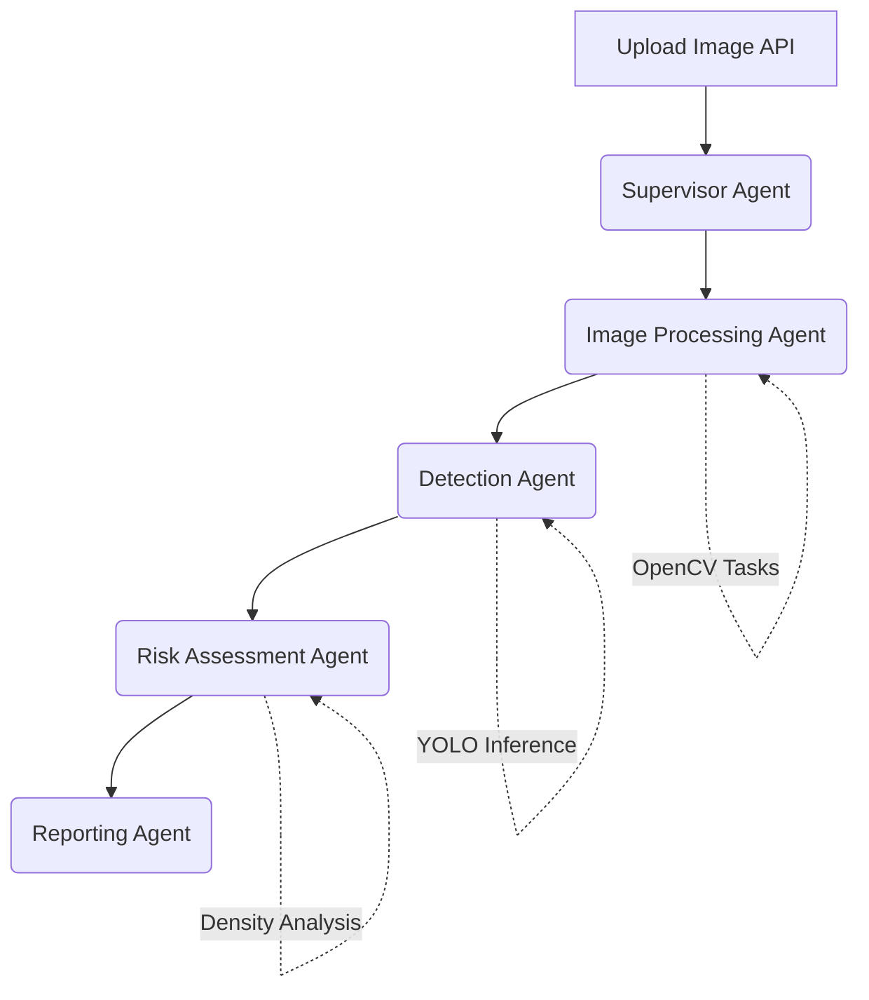
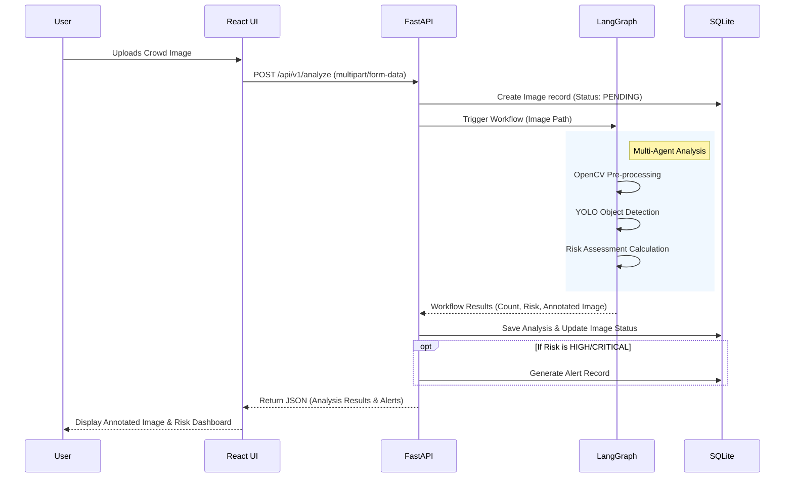

# Crowd Guardian - Architecture Design Document

**Version 1.0 (MVP Phase)**

## 1. Complete System Architecture

The architecture of Crowd Guardian is designed to be modular and decoupled, allowing for rapid iteration during the MVP phase while laying a solid foundation for future scaling. 

The system follows a classic three-tier architecture augmented with an AI multi-agent orchestration layer:

1. **Client Tier (Frontend)**: A React-based web application where users can upload crowd images, view real-time analysis results, and monitor alerts.
2. **API Tier (Backend)**: A FastAPI Python backend that handles RESTful requests, manages database interactions, and orchestrates the AI workflow.
3. **AI Orchestration Tier (LangGraph)**: The core intelligence layer. LangGraph manages the state and flow between specialized AI agents that process the image, detect objects, assess risk, and generate warnings.
4. **Data Tier (Database)**: SQLite database storing image metadata, risk assessments, and historical alerts.

## 2. Multi-Agent Workflow (LangGraph)

The AI engine uses LangGraph to orchestrate a team of specialized agents. This stateful workflow ensures that each step of the analysis is handled by the appropriate expert model.



### Agent Roles:
- **Supervisor Agent**: The orchestrator. Receives the initial image payload and coordinates the execution flow among the worker agents.
- **Image Processing Agent (OpenCV)**: Handles pre-processing (resizing, normalization, contrast enhancement) to ensure the image is optimal for the detection model.
- **Detection Agent (YOLO)**: Runs YOLO inference to detect individuals, bounding boxes, and calculate crowd density/headcounts.
- **Risk Assessment Agent**: Evaluates the detection data against safety thresholds. It calculates localized density and determines the risk level (e.g., Safe, Warning, Critical).
- **Reporting Agent**: Formats the final output, generates actionable early warnings if the risk is high, and persists the results to the database.

## 3. Folder Structure

A clean, production-ready monorepo structure suitable for both MVP development and future scaling.

```text
crowd-guardian/
├── frontend/                     # React Frontend
│   ├── public/
│   ├── src/
│   │   ├── components/           # Reusable UI components (Upload, Dashboard)
│   │   ├── pages/                # Views (Home, Alerts, History)
│   │   ├── services/             # API client services
│   │   └── App.jsx
│   └── package.json
├── backend/                      # Python Backend
│   ├── app/
│   │   ├── api/                  # FastAPI routers and endpoints
│   │   ├── core/                 # App configs, security, constants
│   │   ├── models/               # SQLAlchemy ORM models
│   │   ├── schemas/              # Pydantic validation schemas
│   │   ├── database/             # SQLite connection and migrations
│   │   ├── agents/               # LangGraph multi-agent logic
│   │   │   ├── graph.py          # State graph definition
│   │   │   ├── nodes/            # Individual agent implementations
│   │   │   └── state.py          # LangGraph state schema
│   │   ├── services/             # Computer Vision services (YOLO, OpenCV)
│   │   └── main.py               # FastAPI application entry point
│   ├── tests/                    # Pytest test suite
│   ├── requirements.txt
│   └── .env
├── models/                       # Downloaded ML models
│   └── yolo/                     # YOLOv8/v9 weights (.pt files)
├── data/                         # Local storage
│   ├── images/                   # Uploaded image storage
│   └── crowd_guardian.db         # SQLite database file
└── .gitignore
```

## 4. Database Schema

For V1, SQLite provides a lightweight, zero-configuration database. We will use SQLAlchemy ORM for easy migration in the future.

### Tables:

**1. `images`**
- `id` (PK, UUID)
- `filename` (String)
- `upload_timestamp` (DateTime)
- `file_path` (String)
- `status` (Enum: PENDING, PROCESSED, FAILED)

**2. `analyses`**
- `id` (PK, UUID)
- `image_id` (FK -> images.id)
- `total_people_count` (Integer)
- `max_density_score` (Float)
- `risk_level` (Enum: LOW, MEDIUM, HIGH, CRITICAL)
- `analysis_timestamp` (DateTime)
- `annotated_image_path` (String) - Path to image with YOLO bounding boxes

**3. `alerts`**
- `id` (PK, UUID)
- `analysis_id` (FK -> analyses.id)
- `alert_type` (String) - e.g., "OVERCROWDING", "BOTTLENECK"
- `message` (Text) - "Critical density detected in sector A"
- `created_at` (DateTime)
- `resolved` (Boolean)

## 5. Data Flow Diagram



## 6. Technology Stack Justification

* **React (Frontend)**: Component-based architecture allows for rapid development of dynamic dashboards. Easy to integrate with charting libraries for visualizing risk trends.
* **FastAPI (Backend)**: Extremely fast, natively async, and provides automatic API documentation (Swagger/ReDoc). Ideal for handling heavy ML workloads asynchronously.
* **LangGraph**: Provides a structured, stateful way to manage complex, multi-step LLM and AI workflows. It turns linear scripts into a resilient graph of specialized agents, making it easy to add new capabilities (like a weather-analysis agent) later.
* **YOLO (You Only Look Once)**: State-of-the-art real-time object detection. Perfect for accurate and fast crowd counting and density estimation.
* **OpenCV**: Industry standard for image manipulation. Crucial for preparing images for YOLO and drawing bounding boxes/heatmaps on the output.
* **SQLite**: Requires no background server setup, keeping the MVP lightweight, portable, and easy to run locally for development and presentations.

## 7. Scalability Plan for Future Video Support

Transitioning from static images to live video streams (and eventually CCTV/IoT) requires a shift from a transactional architecture to an event-driven, stream-processing architecture.

### Evolution Path:
1. **From HTTP to WebSockets/WebRTC**: 
   - *Current*: REST API (Upload Image -> Wait -> Get Response).
   - *Future*: FastAPI WebSockets for streaming processed frames back to the frontend in real-time, or WebRTC for low-latency video ingestion.
2. **Message Queuing**: 
   - Introduce **Apache Kafka** or **Redis Streams**. Frame extraction (OpenCV) will push frames to a queue. The LangGraph/YOLO workers will consume frames from this queue independently, decoupling ingestion from processing.
3. **Database Migration**: 
   - Move from SQLite to **PostgreSQL**.
   - Implement **TimescaleDB** (Postgres extension) to handle time-series data (e.g., density metrics logged every second).
4. **Hardware Acceleration & Edge Computing**: 
   - Transition YOLO models to use **TensorRT** for optimized GPU inference.
   - For CCTV integration, consider deploying the Detection Agent to Edge devices (NVIDIA Jetson) to reduce bandwidth, sending only metadata (counts, alerts) to the cloud backend.
5. **Agent State Management**: 
   - LangGraph's state persistence (using Postgres checkpointing) will be crucial for tracking crowds *over time* across multiple frames, enabling predictive risk modeling rather than just static assessment.
